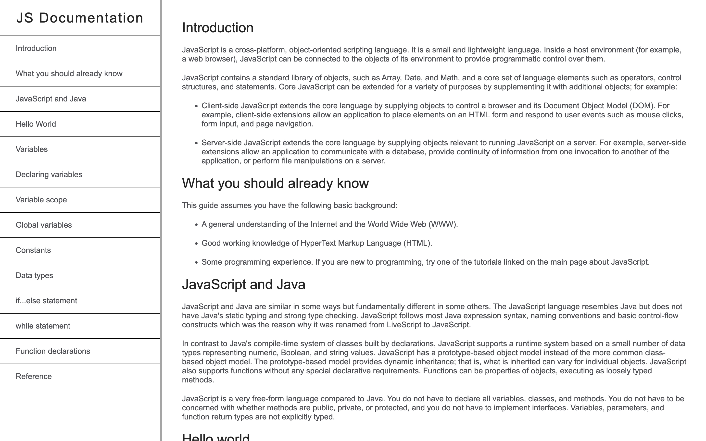

# Documentation Page

A Documentation page for the programming language JavaScript.

## Screenshots

## Demo

[Link](https://thepageguy.github.io/documentation_page/)

## Author

- [@thepageguy](https://www.github.com/thepageguy)

## Acknowledgement

- [FreeCodeCamp](https://www.freecodecamp.org/)

## Tech Stack

**Languages:** HTML5 and CSS3

## Features

- Responsive
- CSS Grid

## Lessons Learned

The Basics of CSS Grids

## Feedback

If you have any feedback, please reach out at thepageguy@mailfence.com.
